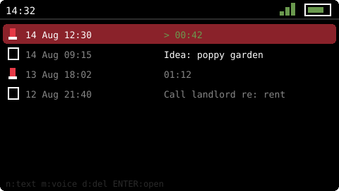
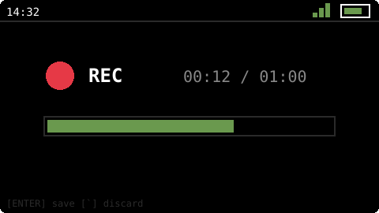
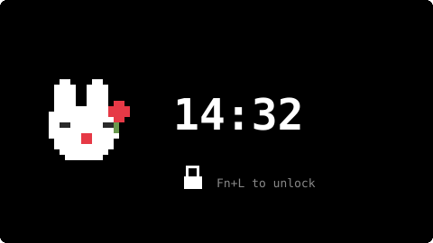

<div align="center">


# Miss Poppy Rabbit

**A fully-local pocket personal assistant OS for the M5Stack Cardputer.**

Multi-calendar agenda with ADHD-friendly escalating alerts · Tasks · Pomodoro ·
Web UI served from the device · A pixel rabbit that judges your productivity


[](https://buymeacoffee.com/sebaspinto)

</div>

---

## What is this?

Miss Poppy Rabbit is a custom firmware — a small launcher-plus-apps "OS" — for the
[M5Stack Cardputer](https://docs.m5stack.com/en/core/Cardputer) and
Cardputer ADV. It turns the little card-sized computer into a personal
assistant that lives entirely on your desk: **no cloud, no accounts, no
subscriptions — 117% local**. Your data stays on a microSD card in your
pocket.

It was built around one core need: **not missing meetings**. Everything else
grew around that.

## Why a dedicated device?

Everything this firmware does, your phone already does. So does your laptop.
Even your smartwatch. That's not an oversight — **that's the problem**.

Modern devices are notification battlefields. Every app fights for your
attention, and when everything notifies, nothing is a priority. Sure, you can
fight back: focus modes, per-app permissions, filters, schedules… and then
re-configure all of it every time you install something new. That permanent
meta-task of *managing what's allowed to interrupt you* is real work — and if
you have ADHD, it's genuinely exhausting work that never ends.

Miss Poppy Rabbit takes the opposite approach: **a dedicated device that can
only interrupt you with the things you chose**. It runs nothing else. No app
can push anything. If the rabbit rings, it's a meeting, a reminder or a
pomodoro — by definition something *you* decided matters. The filtering
problem doesn't get solved here; it simply **ceases to exist**, because there
is nothing to filter.

A quiet little screen on the desk that only speaks when it's important.
That's the entire product.

## Features

### 📅 Multi-calendar Agenda
Four color-coded calendars, built for juggling two jobs and multiple clients.

- Day view and week view with hour-positioned color blocks
- `,` `/` change day · `t` today · `v` switch view · `n` quick-add
- Full event editing, and calendar renaming, in the Web UI

### 🔔 ADHD-friendly alerts
Escalating meeting alerts designed to be impossible to ignore — the heart of the project.

- **10 min before**: gentle arpeggio + banner over whatever you're doing
- **2 min before**: urgent call
- **At start**: *"Are you in this meeting?"* — `ENTER` confirms; anything else re-asks every 5 min
- Melodies loop until dismissed; alerts wake the screen by themselves

### ❗ Reminders
An alarm with a reason — *"Call the bank"* — not a meeting.

- One alarm at the exact time; re-fires every 5 min until you press *done*
- `r` toggle in quick-add, checkbox in the Web UI

### ✅ Tasks
- `n` add · `ENTER` done · `p` priority · `d` delete
- Atomic microSD persistence: a power loss can never corrupt your data

### 🍅 Pomodoro
- Giant progress ring: red work, green break · `ENTER` start/pause · `,` `/` length
- Runs (and rings) as a background service while you use other apps

### 📝 Notes — text & voice
Quick thoughts, captured before they escape.

- **`Fn+M`**: record a voice memo from ANY screen, even display-off
- **`Fn+N`**: quick text note from anywhere
- Voice: WAV streamed to microSD (never buffered in RAM), live VU meter
- Play memos on the device speaker or right in the browser
- Comfy text editing in the Web UI

### 🔒 Pocket lock
- **`Fn+L`** locks/unlocks: screen off, every key swallowed
- Alerts still ring — but your pocket can't accidentally dismiss them

### 🌅 Daily briefing
Your day, before it starts.

- At a configurable hour: every event and reminder, **conflicts highlighted in red**
- Never missed: shows on power-on if the device was off at briefing time

### 🌐 Web UI
`http://prabbit.local` from any browser on your network — embedded in the firmware.

- Tasks, agenda, notes, calendars and pomodoro with **live two-way sync** (WebSocket)
- `.ics` import parsed in your browser; [JSON API](docs/IMPORT_API.md) for external tools
- Auto-sync via the [Chrome extension](extension/): secret ICS feeds or passive capture

### 🕐 Clock · 🔋 Power · 🌍 Languages
- Clock shows your next two events; night mode (dim red) after 2 min idle
- Screen off after 2.5 min; alerts wake it; the waking key never triggers actions
- Full English/Spanish, switchable in Settings; the Web UI follows

### 🐰 The mascot
A white pixel rabbit with a red poppy, drawn from hand-editable character-map
sprites ([`PoppySprites.h`](src/ui/assets/PoppySprites.h)) — she blinks,
reacts to every launcher item with a matching pixel prop, and knows what
117 means.

## Screenshots

*Pixel-accurate mockups rendered from the actual theme and sprites — real
device photos coming soon.*

| Launcher | Agenda | Alert |
|---|---|---|
|  |  |  |

| Pomodoro | Clock | Web UI |
|---|---|---|
|  |  |  |

| Notes | Voice memo | Pocket lock |
|---|---|---|
|  |  |  |

## Installing it on your Cardputer

Works on both the **original Cardputer** and the **Cardputer ADV** — same
binary. The [M5Cardputer library](https://github.com/m5stack/M5Cardputer)
auto-detects the model at boot and abstracts the hardware differences
(GPIO-matrix vs TCA8418 keyboard, NS4168 vs ES8311 audio). The Web UI is
embedded inside the firmware, so it's always a **single binary** — pick your
favorite door:

### 🌐 Web installer (easiest)

Open **[the installer page](https://sebaspinto.github.io/misspoppyrabbit/)**
in Chrome or Edge on desktop, plug your Cardputer in with a USB-C data cable,
click **Install**. Done in a minute — nothing to download or install.

### 🔥 M5Burner

Find **Miss Poppy Rabbit** in the Cardputer category, or burn the merged
`misspoppyrabbit-vX.Y.Z.bin` from
[Releases](https://github.com/SebasPinto/misspoppyrabbit/releases) at
offset `0x0`.

### 🚀 M5Launcher (install from microSD)

Copy `misspoppyrabbit-vX.Y.Z-app.bin` from
[Releases](https://github.com/SebasPinto/misspoppyrabbit/releases) to your
microSD card and install it from the M5Launcher menu.

### 🛠 From source

You'll need [PlatformIO](https://platformio.org/install/cli):

```bash
git clone https://github.com/SebasPinto/misspoppyrabbit.git
cd misspoppyrabbit
pio run -t upload
```

Then on the device:

1. Open **Settings**, scan for WiFi, enter your password, connect. The clock
   syncs via NTP and the Web UI comes up at `http://prabbit.local`.
2. Insert any FAT32 microSD for persistence — the firmware keeps all its data
   under `/mspos/` and won't touch anything else on the card.
3. Pick your timezone in `Settings → Timezone` (default: Bogotá, GMT-5).

## Keyboard reference

| Key | Action |
|---|---|
| `;` `.` | Up / Down |
| `,` `/` | Left / Right (days, weeks, values) |
| `ENTER` | Select / confirm / toggle |
| `` ` `` (ESC) | Back / cancel / snooze |
| `DEL` | Backspace |
| `n` | New (task / event) |
| `r` | Toggle reminder (in event quick-add) |
| `c` | Cycle calendar |
| `d` / `p` | Delete / cycle priority (tasks) |
| `t` / `v` | Today / toggle day-week view (agenda) |
| `m` | New voice note (in Notes) |
| **`Fn+M`** | **Record a voice note from anywhere** |
| **`Fn+N`** | **New text note from anywhere** |
| **`Fn+L`** | **Lock / unlock the device** |

## How it's built

- **ESP32-S3** (no PSRAM — 512KB of SRAM, treated with respect): static
  allocation everywhere, a single shared full-screen canvas, streaming JSON,
  fixed-size structs.
- **App framework**: a tiny app stack (`onEnter/update/draw/onKey/onExit`)
  with dirty-flag rendering at ~30fps and full-frame flicker-free blits.
- **Services, not apps**: WiFi, task store, calendar store, pomodoro, alerts
  and the web server run always, independent of what's on screen. The screen
  apps and the browser are just two clients of the same services.
- **Concurrency**: the async web server never touches data directly — it
  enqueues commands into FreeRTOS queues consumed by the main loop
  (single-writer), with a mutex only for snapshot reads.

More detail in [`docs/ARCHITECTURE.md`](docs/ARCHITECTURE.md) (in Spanish).

## Roadmap

- [x] v0.1 — Core: app framework, launcher, WiFi settings
- [x] v0.2 — Tasks + Pomodoro with microSD persistence
- [x] v0.3 — Web UI with REST + WebSocket
- [x] v0.4 — Multi-calendar Agenda, ADHD alerts, reminders, i18n, power saving
- [x] v0.5 — Calendar import: `.ics` files via the Web UI and
      [`POST /api/events/import`](docs/IMPORT_API.md) for external tools
- [x] v0.6 — Daily briefing with conflict detection, reminders, timezone
      setting, volume, data erase, power saving
- [x] Companion [Chrome extension](extension/) that auto-syncs Google
      Calendar/Outlook — secret ICS feeds or passive capture from the
      calendar tab (for corporate-locked accounts)
- [x] v0.7 — Notes (text + voice memos with global `Fn+M` capture) and
      pocket lock (`Fn+L`)

## Contributing

This is a personal project, public so others can read and learn from it —
but it's **not accepting contributions**. Feel free to fork it and make it
your own rabbit.

---

<div align="center">🐰🌺 <em>Built with a Cardputer, patience, a rabbit — and a poppy.</em><br><br>
If the rabbit saved you from missing a meeting, you can
<a href="https://buymeacoffee.com/sebaspinto">buy me a coffee</a> ☕</div>

<!-- If you ever type 117 in the launcher... the rabbit knows. -->

