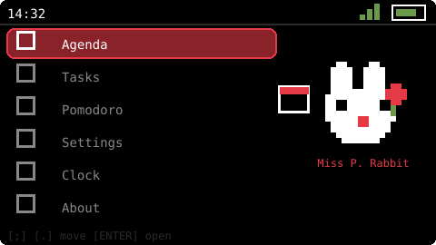
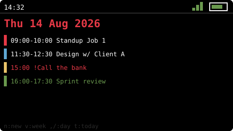
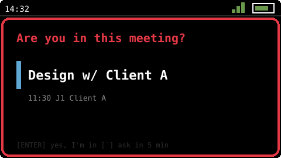
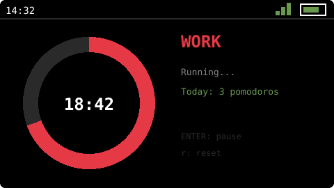
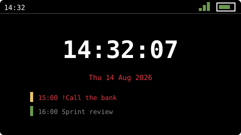
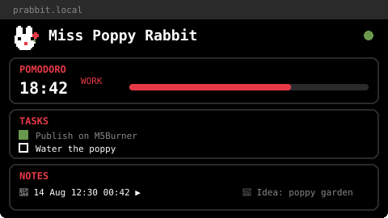

<div align="center">


# Miss Poppy Rabbit

**A fully-local pocket personal assistant OS for the M5Stack Cardputer.**

Multi-calendar agenda with ADHD-friendly escalating alerts · Tasks · Pomodoro ·
Web UI served from the device · A pixel rabbit that judges your productivity


</div>

---

## What is this?

Miss Poppy Rabbit is a custom firmware — a small launcher-plus-apps "OS" — for the
[M5Stack Cardputer](https://docs.m5stack.com/en/core/Cardputer) and
Cardputer ADV. It turns the little card-sized computer into a personal
assistant that lives entirely on your desk: **no cloud, no accounts, no
subscriptions — 117% local**. Your data stays on a microSD card in your
pocket.

It was built around one core need: **not missing meetings**. Everything else
grew around that.

## Why a dedicated device?

Everything this firmware does, your phone already does. So does your laptop.
Even your smartwatch. That's not an oversight — **that's the problem**.

Modern devices are notification battlefields. Every app fights for your
attention, and when everything notifies, nothing is a priority. Sure, you can
fight back: focus modes, per-app permissions, filters, schedules… and then
re-configure all of it every time you install something new. That permanent
meta-task of *managing what's allowed to interrupt you* is real work — and if
you have ADHD, it's genuinely exhausting work that never ends.

Miss Poppy Rabbit takes the opposite approach: **a dedicated device that can
only interrupt you with the things you chose**. It runs nothing else. No app
can push anything. If the rabbit rings, it's a meeting, a reminder or a
pomodoro — by definition something *you* decided matters. The filtering
problem doesn't get solved here; it simply **ceases to exist**, because there
is nothing to filter.

A quiet little screen on the desk that only speaks when it's important.
That's the entire product.

## Features

### 📅 Multi-calendar Agenda
Four color-coded calendars (built for juggling two jobs and multiple clients).
Day view, week view with hour-positioned color blocks, and quick event
creation from the device keyboard. Full event editing lives in the Web UI.

### 🔔 ADHD-friendly escalating alerts
This is the heart of the project. For every meeting:

1. **10 minutes before** — a gentle ascending arpeggio + a banner over
   whatever you're doing
2. **2 minutes before** — a more urgent call
3. **At start time** — the device asks *"Are you in this meeting?"* with a
   blinking border and an insistent chime. Pressing `ENTER` means *"yes, I'm
   in"* and silences it. Anything else means *"ask me again in 5 minutes"* —
   and it will, until you confirm or the event ends.

Melodies loop until you dismiss them. They are tone sequences (zero RAM for
audio samples) played through a non-blocking melody engine.

### ❗ Reminders
An alarm with a reason — *"Call the bank"* — not a meeting. No pre-alerts:
one alarm at the exact time that re-fires every 5 minutes until you press
*done*. Create them with the `r` toggle in quick-add, or a checkbox in the
Web UI.

### ✅ Tasks
Simple task list with priorities (high = poppy red), done-state with
strikethrough, and instant persistence to microSD using atomic writes
(a power loss can never corrupt your data).

### 🍅 Pomodoro
Classic work/break cycle with a giant progress ring (red for work, green for
break), adjustable duration, daily counter and speaker chimes. The timer is a
system service: it keeps running (and ringing) while you use other apps.

### 📥 Calendar import
Export an `.ics` from Google Calendar or Outlook and drop it into the Web UI:
it's parsed **in your browser** (timezones, basic recurrence expansion), you
pick a target calendar, and the events land on the device. Imports are
idempotent — re-importing the same file never duplicates anything. The same
[JSON API](docs/IMPORT_API.md) is open for external tools.

### 🌐 Web UI — served from the device
Connect the Cardputer to WiFi and open **`http://prabbit.local`** from any
browser on your network. Manage tasks, events, calendars and the pomodoro —
with **live sync via WebSocket** in both directions: check a task on the
device and watch the browser update, and vice versa. The page is a single
gzipped HTML file served from flash. Two concurrent clients max (no PSRAM,
no mercy).

### 🕐 Clock
Big NTP-synced clock showing your next two events. After 2 minutes idle it
switches to a **night mode**: minimum backlight, dim red `HH:MM` — a classic
bedside clock. Any key brings it back.

### 🔋 Power saving
The screen turns off after 2.5 minutes of inactivity (backlight is what
drains an LCD). All services keep running; alerts wake the screen by
themselves; the key that wakes it is swallowed so waking never triggers an
action.

### 🌍 English / Spanish
Full i18n via a string catalog. Default is English; switch at
`Settings → Language`. The Web UI follows the device language automatically.

### 🐰 The mascot
A white pixel rabbit with a red poppy, drawn from hand-editable character-map
sprites (each character is one pixel — edit them in
[`PoppySprites.h`](src/ui/assets/PoppySprites.h) with no tools). She blinks,
twitches her ears, and reacts to every launcher item with a matching
pixel prop: a calendar, a checkmark, a tomato, a gear, a clock, a poppy.

## Screenshots

*Pixel-accurate mockups rendered from the actual theme and sprites — real
device photos coming soon.*

| Launcher | Agenda | Alert |
|---|---|---|
|  |  |  |

| Pomodoro | Clock | Web UI |
|---|---|---|
|  |  |  |

## Flashing it to your Cardputer

Works on both the **original Cardputer** and the **Cardputer ADV** — same
binary. The [M5Cardputer library](https://github.com/m5stack/M5Cardputer)
auto-detects the model at boot and abstracts the hardware differences
(GPIO-matrix vs TCA8418 keyboard, NS4168 vs ES8311 audio).

You'll need [PlatformIO](https://platformio.org/install/cli) and a USB-C
data cable.

```bash
git clone <this-repo>
cd mspos

# 1. Build and flash the firmware
pio run -t upload

# 2. Flash the Web UI assets (LittleFS partition) — needed once, and
#    again whenever web/index.html changes
pio run -t uploadfs
```

Then on the device:

1. Open **Settings**, scan for WiFi, enter your password, connect. The clock
   syncs via NTP and the Web UI comes up at `http://prabbit.local`.
2. Insert any FAT32 microSD for persistence — the firmware keeps all its data
   under `/mspos/` and won't touch anything else on the card.
3. Set your timezone in [`src/core/Config.h`](src/core/Config.h) before
   flashing (default: Bogotá, GMT-5).

## Keyboard reference

| Key | Action |
|---|---|
| `;` `.` | Up / Down |
| `,` `/` | Left / Right (days, weeks, values) |
| `ENTER` | Select / confirm / toggle |
| `` ` `` (ESC) | Back / cancel / snooze |
| `DEL` | Backspace |
| `n` | New (task / event) |
| `r` | Toggle reminder (in event quick-add) |
| `c` | Cycle calendar |
| `d` / `p` | Delete / cycle priority (tasks) |
| `t` / `v` | Today / toggle day-week view (agenda) |

## How it's built

- **ESP32-S3** (no PSRAM — 512KB of SRAM, treated with respect): static
  allocation everywhere, a single shared full-screen canvas, streaming JSON,
  fixed-size structs.
- **App framework**: a tiny app stack (`onEnter/update/draw/onKey/onExit`)
  with dirty-flag rendering at ~30fps and full-frame flicker-free blits.
- **Services, not apps**: WiFi, task store, calendar store, pomodoro, alerts
  and the web server run always, independent of what's on screen. The screen
  apps and the browser are just two clients of the same services.
- **Concurrency**: the async web server never touches data directly — it
  enqueues commands into FreeRTOS queues consumed by the main loop
  (single-writer), with a mutex only for snapshot reads.

More detail in [`docs/ARCHITECTURE.md`](docs/ARCHITECTURE.md) (in Spanish).

## Roadmap

- [x] v0.1 — Core: app framework, launcher, WiFi settings
- [x] v0.2 — Tasks + Pomodoro with microSD persistence
- [x] v0.3 — Web UI with REST + WebSocket
- [x] v0.4 — Multi-calendar Agenda, ADHD alerts, reminders, i18n, power saving
- [x] v0.5 — Calendar import: `.ics` files via the Web UI and
      [`POST /api/events/import`](docs/IMPORT_API.md) for external tools
- [ ] Next — companion Chrome extension that auto-syncs Google
      Calendar/Outlook (separate project)

## Contributing

This is a personal project, public so others can read and learn from it —
but it's **not accepting contributions**. Feel free to fork it and make it
your own rabbit.

---

<div align="center">🐰🌺 <em>Built with a Cardputer, patience, a rabbit — and a poppy.</em></div>

<!-- If you ever type 117 in the launcher... the rabbit knows. -->

